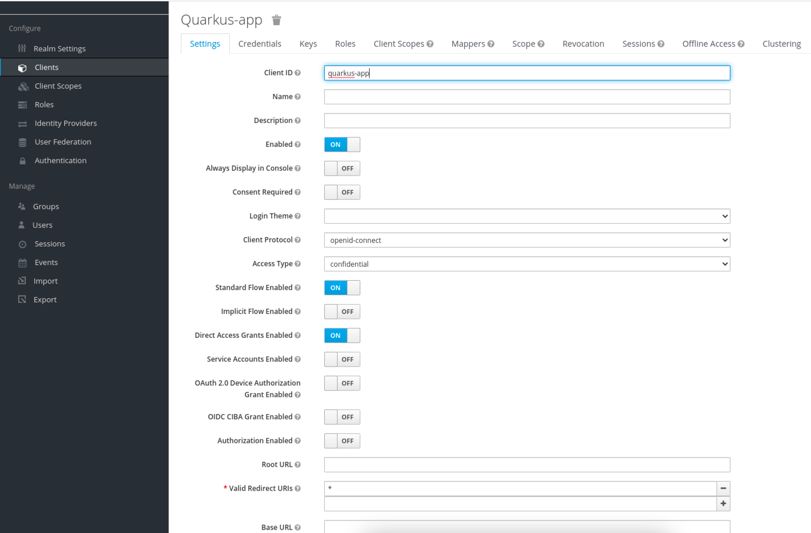
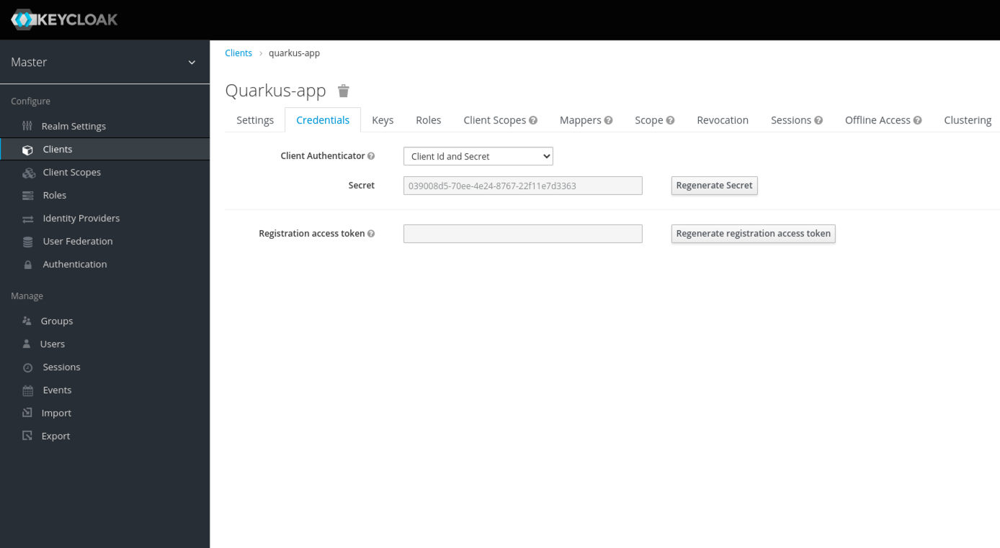

# Quarkus Security

>  **This repo is best used in association with the talk I have given at Red Hat Hackfest**

This project showcases how Quarkus and OpenShift can help to build a thourhg security landscape.
Specifically how Quarkus enables us to tackle the following aspects

- Authentication and Authorisation
- Securing Supply Chain
- Sensitive information
- Observability

Refer to Quarkus [General guide](https://quarkus.io/guides/security) for mode details

## Authentication and Authorisation
See how Quarkus facilitates integration with OAuth2 and OIDC and how easy is to secure the API
- [Web App](https://quarkus.io/guides/security-openid-connect-web-authentication)
- [API using Bearer Token](https://quarkus.io/guides/security-openid-connect)
- [Keycloak](https://www.keycloak.org/operator/basic-deployment)

Refer to application.properties for setting it up. In this example we use KeyCloak as the IDP 

## Securing Supply Chain
The code security is important but often the libraries that we use from the wild get overlooked. 
Not only the libraries, the base container we use for packaging our application may have vulenrabilities
I will show you how to use Red Hat BOM, maven plugins and container scanning to reduce this risk
- [Quarkus BOM](https://quarkus.io/guides/platform)
- [Maven OWASP Plugin]()
- [Clair Scanner](https://github.com/arminc/clair-scanner/blob/master/example-run.sh)

## Sensitive Information
The code you write will most probably need some passwords or private keys or some other sensitive information to perform a business action.
It is critical that you assess how this sensitive data is accessed and managed within your application.
You will see how Hashicorp Vault can enable you to store, manage and use this information in Quarkus.
- [Hashicorp Vault](https://learn.hashicorp.com/tutorials/vault/kubernetes-minikube-raft)
- [Quarkus Vault Intgegration](https://quarkiverse.github.io/quarkiverse-docs/quarkus-vault/dev/index.html)
- Read [more](https://cloud.redhat.com/blog/managing-secrets-openshift-vault-integration?extIdCarryOver=true&sc_cid=701f2000001Css5AAC) about Vault

## Observability
Observability enables you to react to any security incident and enahnce your security posture.
Quarkus provides excellent OOB metrics for your applications. It is recommended to expose business critical metrics such as 'Account NOT Found'
to keep monitoring any unusual activity related to your application.
You will see by using Quarkus custom metrics, you can monitor critical functions of your applications and detect any security event in due time.
- [Custom Metrics](https://quarkus.io/guides/smallrye-metrics)


# Running this sample

## PreRequisite
- Install Minikube
- Install [NGinx](https://kubernetes.io/docs/tasks/access-application-cluster/ingress-minikube/) Ingress provider
- Install [Keycloak](https://www.keycloak.org/operator/basic-deployment) on minikube default namespace
- Install [Hashicorp Vault](https://learn.hashicorp.com/tutorials/vault/kubernetes-minikube-raft) 
- Config values in [Vault](https://quarkiverse.github.io/quarkiverse-docs/quarkus-vault/dev/vault-auth.html)

## Package and Deploy App
How to [publish](https://dev.to/marcuspaulo/tutorial-publish-a-quarkus-application-in-kubernetes-minikube-and-dockerhub-36nd) a quarkus image to minikube
```bash
eval $(minikube -p minikube docker-env)
mvn clean package -Dquarkus.container-image.build=true -Dquarkus.jib.base-jvm-image=registry.access.redhat.com/ubi8/openjdk-11-runtime:1.14 -DskipTests=true
```

## Run local container scan
```bash
scanimage.sh CONTAINER_NAME
```

## KeyCloak setup
- Setup Client in KeyCloak

- Get the Client authenticator credentials


The application endpoint is available at /helloworldapi